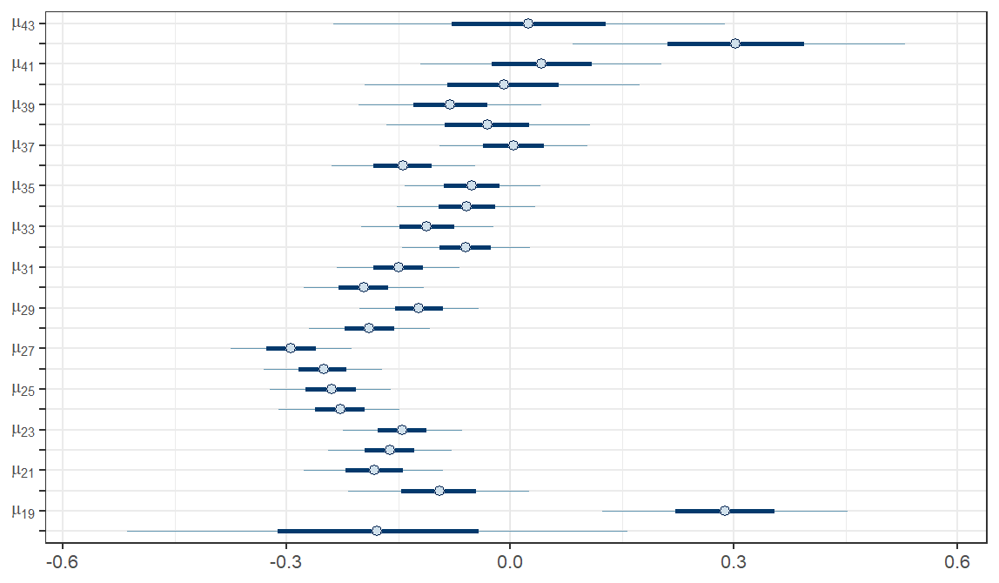
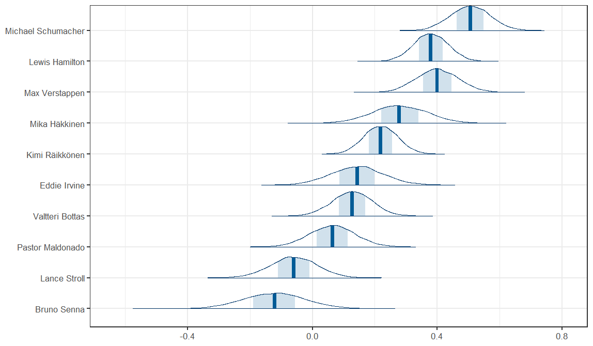

## The Effect of an F1 Driver's Age on their Performance: A Bayesian Analysis

We conduct a Bayesian analysis to study the effect of an F1 driver's age on their qualifying performance against their teammate. The data used in this analysis was provided by the [Ergast Developer API](http://ergast.com/mrd/).

----

### Data

We consider the difference of a driver's lap time and his teammate's lap time in the last session (Q1/Q2/Q3) they both participated in as a measure of performance. Further, the career average of a driver's difference to his teammate is substracted from this value to get a "normalized" value that represents how well the driver performed compared to his career average.

The basic idea in the analysis is to divide this data to age groups and fit a separate/hierarchical normal model to each group and then compare the fitted parameters of these groups, mainly the mean parameter, to evaluate how the age groups compare to one another.

   
   
Figure 1: The distribution of the data in each age group. A slight trend can be observed here where performance seems to be increasing until around the age of 27, after which it appears to begin to decline.

 

----

### Model

We evaluated multiple different models and concluded the most useful one to be a separate normal model with an additional parameter accounting for the effect of teammate to be the best, which can be formulated as follows:

  

Here, <i>ti</i> denotes the time difference on data row <i>i</i>, <i>μ</i>age(<i>i</i>) and <i>σ</i>age(<i>i</i>) are the mean and standard deviation parameters of the age group corresponding the driver of that row (age of that driver), and <i>α</i>teammate(<i>i</i>) is a parameter corresponding to the teammate of the driver of that row. Each driver in the dataset has their own <i>α</i> parameter. The purpose of this parameter is to shift the expected difference to teammate based on how good the teammate is. 

----

### Results
 
 

   
   
Figure 2: The probability distribution of the mean parameter for each age. Similar trend observations can be done as previously. The posterior probability of the mean parameter of age group 27 being the best was around 92%.

 

   
   
Figure 3: The distribution of the <i>α</i> parameters for some renowned drivers

----

### Authors

Miro Kaarela ([mkaarela](https://github.com/mkaarela)), Roope Kausiala ([AdmiralBulldog](https://github.com/AdmiralBulldog)), Tatu Timonen ([timonent](https://github.com/timonent))
